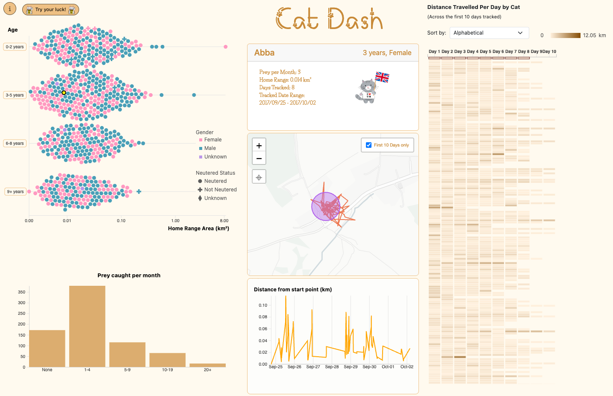

# CatDash
The data in this visualization comes from a study by R. Kays et al. that tracked 925 pet cats across 4 primary countries—the United States, United Kingdom, Australia, and New Zealand—for up to 98 days to find estimates of their home ranges. Owners were also surveyed on their cat’s demographic and behavioural characteristics including age, sex, neutered status, and prey caught per month. More information can be found in the associated research article linked [here](https://zslpublications.onlinelibrary.wiley.com/doi/10.1111/acv.12563). As a result of cleaning the data, this visualisation contains the data of 747 cats from the original study.

## Preview

